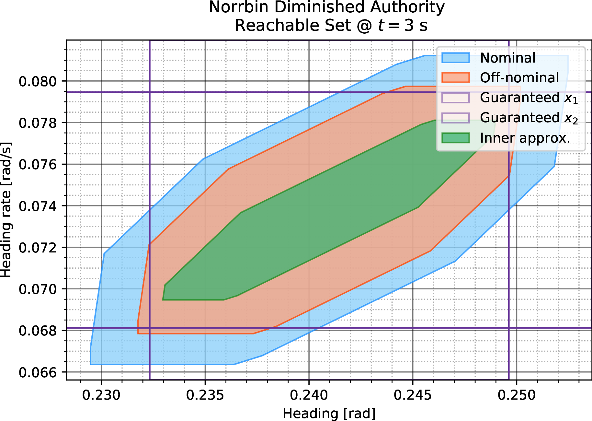

# Guaranteed Reachability

Code and algorithms for computing online guaranteed inner- and outer-approximations of reachable sets.

## Theory

The main idea behind our method is that we know what states our system can _nominally_ reach starting from a particular initial state after a given amount of time; this is known as the _nominal reachable set_. We then consider the case of our system dynamics changing (thus becoming _off-nominal_), in addition to our control authority changing (i.e., the allowable control inputs we can apply changes).

Naturally, one may ask what the reachable set will be for this off-nominal case. In some applications, computation from scratch is intractable, say, if the system that would compute the reachable set has limited resources (e.g., memory), or the exact change in dynamics is not clearly known (say, we only have a worst-case norm bound on some parameters). In either case, one wishes to _use the nominal reachable set_, and modify it to be either an inner- or outer-approximation of the off-nominal reachable set, without explicitly recomputing the exact shape of the set from scratch. This is exactly what our method allows for; given some rudimentary bounds on the change in dynamics, we can directly compute how to reshape the nominal reachable set to approximate the (unknown) off-nominal reachable set.

More information on these ideas can be found [in a talk I gave on the topic](https://www.youtube.com/watch?v=45KJUcCioko).

### Further Reading

The theoretical underpinnings for this work are currently under submission under the title 'Online Guaranteed Reachable Set Approximation for Systems with Changed Dynamics and Control Authority.' A preprint version [can be found on ArXiV](https://arxiv.org/abs/2203.10220).

## Brief Theory

Consider the nominal dynamics

<!-- $\dot{x}(t) = f(x(t), u(t)),$ --> 

where <!-- $x(t) \in \mathbb{R}^n$ --> , <!-- $u(t) \in \mathbb{R}^m$ --> , and the off-nominal dynamics

<!-- $\dot{\bar{x}}(t) = g(\bar{x}(t), \bar{u}(t)).$ --> 

Let us first assume <!-- $g = f$ --> . Define <!-- $\tilde{f} (t, \tilde{x}(t), \tilde{u}(t)) := f(t, x(t), u(t)) - f(t, \bar{x}(t), \bar{u}(t))$ --> , <!-- $\tilde{x}(t) := x(t) - \bar{x}(t)$ --> , and <!-- $\tilde{u}(t) := u(t) - \bar{u}(t)$ --> .

A running assumption in our work, namely a nonlinear growth condition, reads

---

**Assumption 2**

For all <!-- $x \in \mathbb{R}^n$, $u \in \mathscr{U}$, $t_0 \leq t < \infty$ --> 
    
<!-- $\Vert \tilde{f}(t, \tilde{x}, \tilde{u}) \Vert \leq a(t) w(\Vert \tilde{x} \Vert, \Vert \tilde{u} \Vert) + b(t)$ --> 

where <!-- $a, b$ -->  are continuous and positive and <!-- $w$ -->  is continuous, monotonic, nondecreasing and positive. In addition, <!-- $w$ -->  is uniformly monotonically nondecreasing in <!-- $\Vert \tilde{u} \Vert$ --> .

---

For the off-nominal dynamics <!-- $g$ --> , we assume the following:

---

**Assumption 3**

For all <!-- $x \in \mathbb{R}^n$ --> , <!-- $u \in \mathscr{U}$ --> , <!-- $t_0 \leq t < \infty$ --> , we have
<!-- $\Vert g(t, x, u) - f(t, x, u) \Vert \leq \gamma(t),$ --> 
where <!-- $\gamma$ -->  is a positive, continuous function on <!-- $[t_0, \infty)$ --> .

---

Equipped with this information, we present a ball-based version of the _Bihari inequality_:

---
**Lemma 1 (Modified Bihari Inequality)**

Assume Assumptions 2 and 3 hold. Let there be <!-- $\epsilon \geq 0$ -->  and <!-- $\kappa \geq 0$ --> , such that <!-- $\sup_{t \in [t_{\mathrm{init}}, t_f]} \Vert u(t) - \bar{u}(t) \Vert \leq \epsilon$ --> , <!-- $\delta := \max_{u \in \mathscr{U}} \Vert u \Vert$ --> , and <!-- $d_{\text{H}} (\mathscr{X}_0, \bar{\mathscr{X}}_0) \leq \kappa$ --> .

Then, <!-- $\tilde{x}(t)$ -->  satisfies
<!-- $\Vert \tilde{x}(t) \Vert \leq G^{-1} \left[ G\left( \kappa + \int_{t_0}^t b(\tau) + \gamma(\tau) \mathrm{d}\tau \right) + \int_{t_0}^t a(\tau) \mathrm{d}\tau \right] =: \eta(t, \epsilon, \kappa)$ --> 
for all <!-- $t \in [t_{\mathrm{init}}, t_f]$ --> , where
<!-- $G(r) := \int_{r_0}^r \frac{\mathrm{d}s}{w(s, \delta)}, \quad r > 0, r_0 > 0,$ --> 
for arbitrary <!-- $r_0 > 0$ -->  and for all <!-- $t \geq t_0$ -->  for which it holds that
<!-- $G\left( \Vert x(t_0) \Vert + \int_{t_0}^t b(\tau) + \gamma(\tau) \mathrm{d}\tau \right) + \int_{t_0}^t a(\tau) \mathrm{d}\tau \in \mathrm{dom}(G^{-1}).$ --> 
---

We are mostly interested in the function <!-- $\eta(t, \epsilon, \kappa)$ --> . Let <!-- $\mathbb{X}_t^\rightarrow$ -->  denote the known nominal reachable set, and let <!-- $\bar{\mathbb{X}}_t^\rightarrow$ -->  denote the unknown off-nominal reachable set. We note to define one more operation before we can state one of our main results.

Given a set <!-- $X \subseteq \mathbb{R}^n$ -->  and a scalar <!-- $\epsilon \geq 0$ --> , let the ball-based fattening of <!-- $X$ -->  by <!-- $\epsilon$ -->  be defined as:
<!-- $X_{+\epsilon} = \{x + b : x \in X, b \in \mathcal{B}_\epsilon\},$ --> 
where <!-- $\mathcal{B}_\epsilon$ -->  is a closed ball of radius <!-- $\epsilon$ --> .

Given the assumptions of Lemma 1, as well as some additional mild technical assumptions, our theory proves:

- Inner-approximation:
<!-- $\mathbb{X}_t^\rightarrow \setminus (\partial\mathbb{X}_t^\rightarrow)_{+\eta(t, \epsilon, \kappa)} \subseteq \bar{\mathbb{X}}_t^\rightarrow.$ --> 
- Outer-approximation
<!-- $(\mathbb{X}_t^\rightarrow)_{+\eta(t, 2\delta + \epsilon, \kappa)} \supseteq \bar{\mathbb{X}}_t^\rightarrow.$ --> 

We also provide tighter bounds by consider hyperrectangular fattenings, which consider each dimension separately; details [can be found here](https://arxiv.org/abs/2203.10220).

## Implementation

While the slimming and fattening operations are quite straightforward, obtaining <!-- $\eta(t, \epsilon, \kappa)$ -->  is the hardest step.

In our implementation, we use trapezoidal integration to obtain <!-- $G$ -->  and the integrals of <!-- $a, b, \gamma$ --> . To compute <!-- $G^{-1}$ --> , we use the secant method with tight tolerances.

For a Python implementation, see [`python/bihari.py](python/bihari.py) as well as the inline documentation.

## Prerequisites

This demo should work on Python 3.6 or greater, with the same dependencies as outlined in [`python/requirements.txt`](python/requirements.txt):
- numpy
- scipy
- shapely
- matplotlib

In addition, the `*.m` scripts require MATLAB (or GNU Octave, though only tested on MATLAB R2019b) to run, with [CORA Toolbox](https://tumcps.github.io/CORA/) R2020 installed. We have provided precomputed outputs for all Matlab scripts, so this is not necessary per se. Raw output data can be found in the [`raw/`](raw/) folder.

## Usage

You can simply run the [`python/example.py`](python/example.py) file to run a demo that uses the provided `python/example*.txt` files to show the theory in action. Both the inner approximation and the off-nominal reachable set are plotted.

### Example 1: Norrbin Ship

We consider the following dynamics, which describe the heading of a ship cruising at fixed speed, controlled by a changing rudder angle. This model is due to Norrbin[^1]:

We consider changes in the velocity, as well as the rudder effectiveness (maximum rudder movement). The code can be found in the various `python/norrbin*.py` files, with the nominal and off-nominal reachable sets being produced in the `python/norrbin*.txt` files.

[^1]: T. Fossen and M. Paulsen, "Adaptive feedback linearization applied to steering of ships," in The First IEEE Conference on Control Applications. Dayton, USA: IEEE, 1992, pp. 1088-1093.

#### Results

A small demo video [can be found here](https://youtu.be/5eUINOGJ_0Y).

> Inner approximation of the off-nominal reachable set of the Norrbin model in the case of diminished control authority, as obtained using a ball-based slimming operation. The cross-hatched areas each denote an interval on the $i$-th Cartesian dimension in which it is guaranteed that there exists at least one state $y$ in the off-nominal reachable set such that $y_i = x_i$, where $x_i$ lies on the interval.

| 0.5 s | 1 s | 3 s |
|:--:|:--:|:--:|
|  |  |  |

| Decreased speed | Increased speed | 
|:--:|:--:|
|  |  |

### Example 2 & 3: Cascaded and Interconnected Systems

These latter two examples are concerned with showcasing the scalability of our approach. Details are and results are omitted here, but we invite the interested reader to [study the results](https://arxiv.org/abs/2203.10220) and the code (in `python/utri*.py` and `python/iconn*.py`, respectively). The goals of these examples is also to show how our hyperrectangular slimming/fattening approach is much tighter than classical ball-based results.

#### Results

> Projected length ratios of the lower triangular system example by dimension using hyperrectangular and ball-based slimming operations.

| Dimension | Hyperrect. inner-approx./Off-nominal length | Ball-based inner-approx./Off-nominal length |
|:--|:--:|:--:|
| 1 | 88.3% | 29.8% |
| 2 | 87.7% | 41.7% |
| 3 | 87.0% | 52.8% |
| 4 | 63.8% | 18.8% |
| 5 | 58.0% | 30.3% |

> Projected length ratios of the interconnected system example by dimension using hyperrectangular and ball-based slimming operations.

| Dimension | Hyperrect. inner-approx./Off-nominal length | Ball-based inner-approx./Off-nominal length |
|:--|:--:|:--:|
| 1 | 61.0% | 34.3% |
| 2 | 95.5% | 89.7% |
| 3 | 67.4% | 0% |
| 4 | 71.7% | 0% |
| 5 | 80.4% | 13.6% |

## License
[MIT](https://choosealicense.com/licenses/mit/)